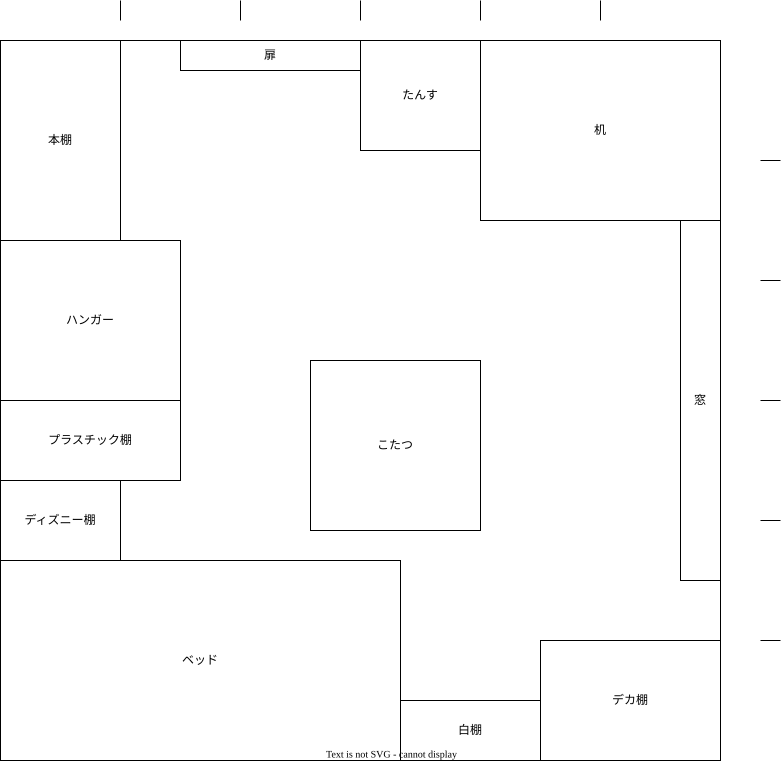

# 部屋図
  

# 物の置き場所定義
## 白棚
### 下から1段目
- シャンプー
- 薬局で買うもの系
- アイマスク
- ウエットティッシュ
- ドライヤー

### 下から2段目
#### 毎日使う薬系
- 髭剃りやボディートリマー
- 化粧水や乳液などのスキンケア用品
- 耳かき
- 爪切り

### 棚の上
なし

## デカ棚
### 下から1段目
- 電子工作関連
- PCパーツなど
- ロキシーフィギュア
- その他オタクグッズ

### 下から2段目
- 工具類
- PC周辺機器
- アクションカメラ

### 下から3段目(手に届きやすい)
#### 出かけるときに持っていくもの
- 財布
- 鍵
- 折りたたみ傘
- メモ帳
- ペン
- マスク
- 日焼け止め
- 水筒
- クリアファイル
- PCケース

### 下から4段目(手に届きやすい)
- 充電コードなど
- 櫛
- ファブリーズ
- ヘルメット
- 薬類 (体温計、風薬、絆創膏など)

### 棚の上
